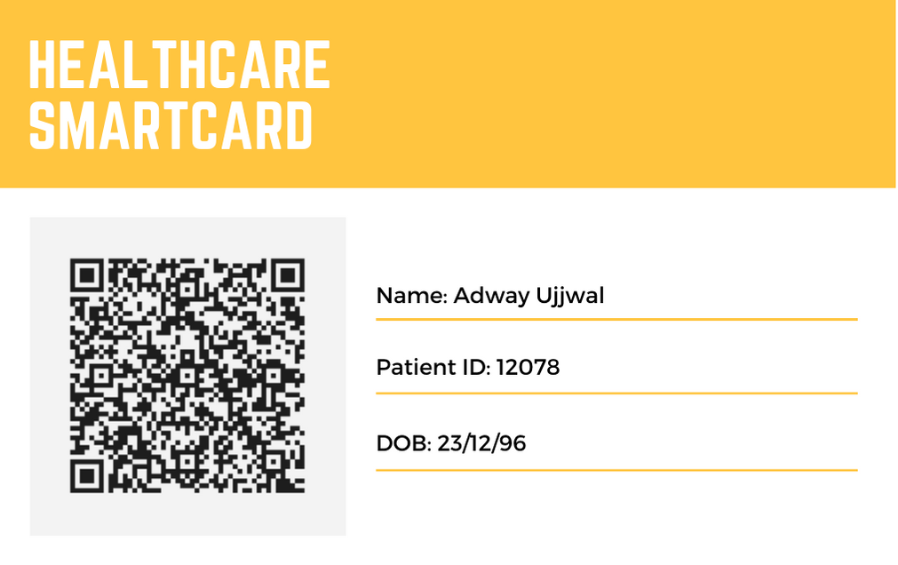
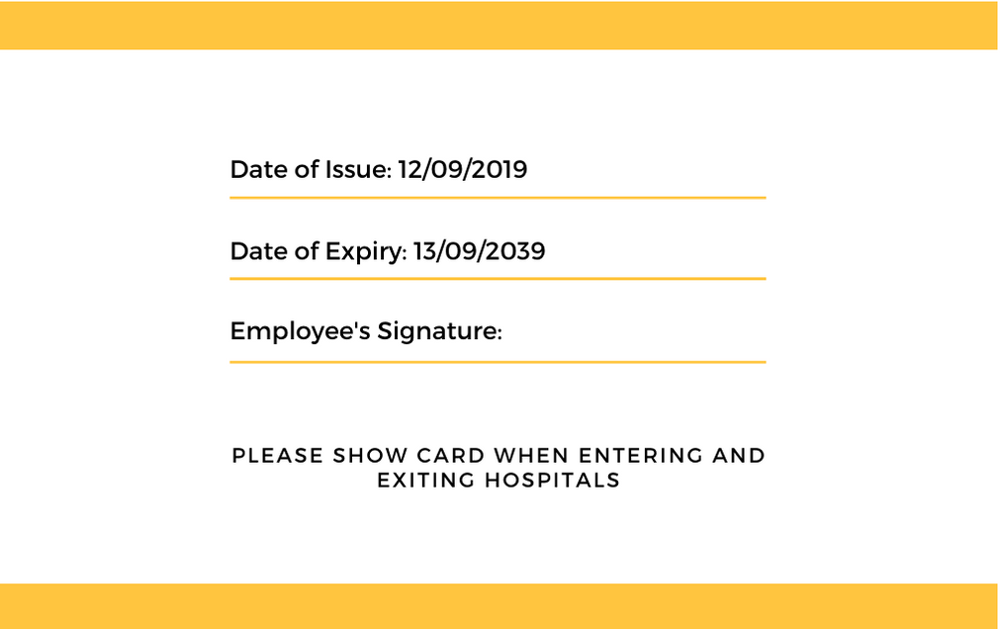

# QRBarcodeScannerAndroidApp

This Project is healthcare Record/History checking system speciall developed for Doctors. This application and smart health cards are going to the help doctors in getting all the previous health records of the patients that will include - (Previous medications, Allergies, Diseases, Blood Group, Vaccination statues and many more).

This way doctors can save their time in getting history from the patient and looking at all the records will help them work more efficiently and give proper medications to the concerned patient

I developed a QR code based card that contained all the details of the patient's medical history. This system can be very useful for doctors as they can know patient's medical history like medications, diseases, blood group and many more. Generally in the current scenario doctors have to waste a lot of time in collecting a patient's history also sometimes there are communication barriers. This android QR code scanner app is the ultimate solution to this problem as doctor's can use this android app to scan the QR code and get patient's history all at one place.

